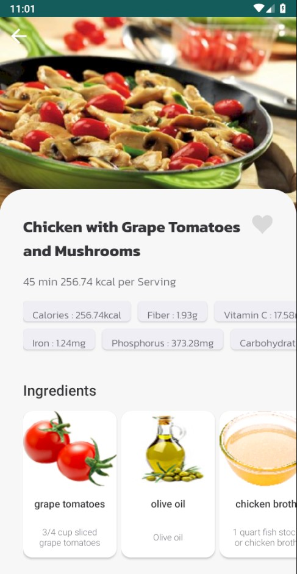
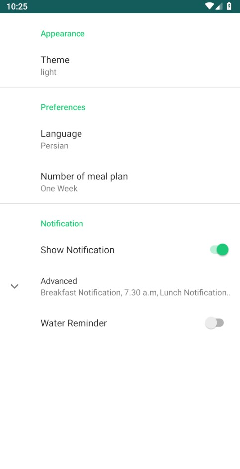

# Heat
A Diet Food Consultant for suggesting foods

## Introduction
This is a food recommendation application based on the MVVM architectural pattern.
This project is my final bachelor project.

## Technologies & Architecture 

#### Technologies
* Android, Kotlin 
* [Room](https://developer.android.com/jetpack/androidx/releases/room/) - Local DataBase
* [Kodein](https://github.com/kosi-libs/Kodein) - dependency injection
* [Groupie](https://github.com/lisawray/groupie) - recyclerviews
* [lottie](https://github.com/airbnb/lottie-android) - animations
* [retrofit](https://github.com/square/retrofit)
* [Glide](https://github.com/bumptech/glide) - Image loading and Caching

#### Architecture
Model-View-ViewModel

* [ViewModel](https://developer.android.com/topic/libraries/architecture/viewmodel)
* [LiveData](https://developer.android.com/topic/libraries/architecture/livedata)
* [DataBinding](https://developer.android.com/topic/libraries/data-binding)
* [Navigation Component](https://developer.android.com/guide/navigation)
* [Kotlin Android Coroutines](https://developer.android.com/kotlin/coroutines)

## Screenshots

### Sruvey

  

### Register and HomePager

  
  
  

### Daily Nutrition and TrackFoods

  
  
  

### Search

  
  

### Profie and setting

  
  

